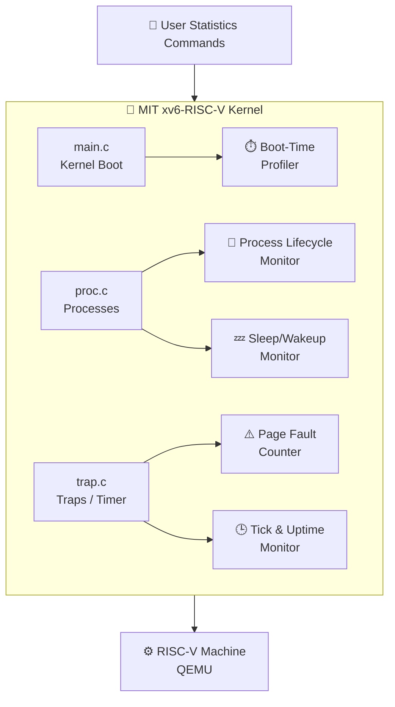
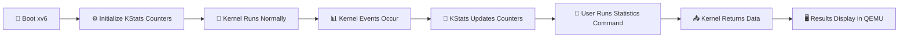
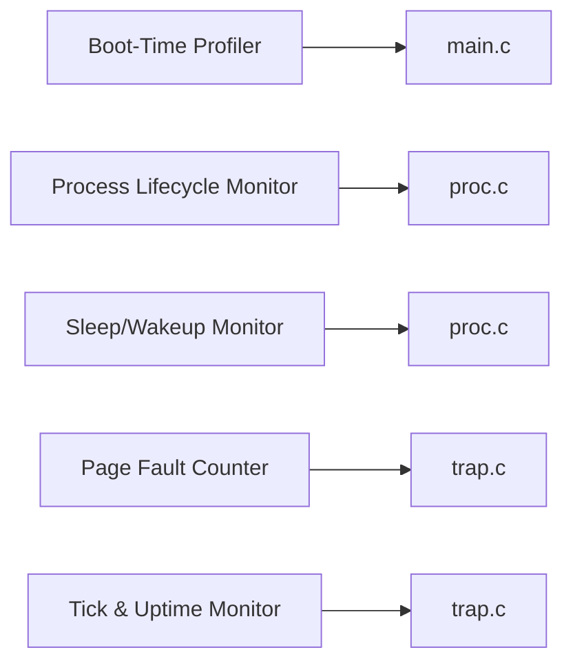

# 📊 KStats — Lightweight Kernel Statistics for xv6-RISC-V

> **Operating Systems Project Proposal**  
> Base Kernel: **MIT xv6-RISC-V**

---

## 📌 Project Overview

**KStats** is a university Operating Systems project based on the official **MIT xv6-RISC-V kernel**.

The project will extend xv6 by adding **5 proposed lightweight kernel-monitoring modules**. These modules are designed to be simple to understand, easy to implement, easy to test, and suitable for a university demonstration.

The project focuses on collecting useful kernel statistics without redesigning major xv6 subsystems.

---

## 🧩 Proposed 5 Modules

### 1. ⏱️ Boot-Time Profiler
Measures the time or CPU/timer cycles used by important xv6 kernel initialization stages during boot.

### 2. 👤 Process Lifecycle Monitor
Tracks basic process activity such as process creation, process exit, and completed process cleanup/reaping events.

### 3. 💤 Sleep/Wakeup Activity Monitor
Counts how often processes go to sleep and how often sleeping processes are awakened by the kernel.

### 4. ⚠️ Page Fault Counter
Tracks page-fault events handled by the kernel and records basic fault statistics.

### 5. 🕒 Kernel Tick & Uptime Monitor
Tracks timer ticks and provides simple system uptime and timer-activity statistics.

---

## 🏗️ System Architecture



---

## 🔄 Working Flow



---

## 🔗 Module-to-Kernel Mapping



---

## 🛠️ Main Technologies

- **C** — kernel and user-space code
- **RISC-V** — target architecture
- **MIT xv6-RISC-V** — base operating system
- **QEMU** — RISC-V emulation
- **GNU Make** — build system
- **Git & GitHub** — version control and documentation
- **WSL / Ubuntu** — recommended development environment

---

## 🎯 Final Goal

```text
MIT xv6-RISC-V
      +
5 Lightweight Kernel Statistics Modules
      =
KStats Enhanced xv6 Kernel
```

The project is intended to remain simple enough to understand, implement, test, and explain confidently during a university presentation or viva.

---

## 📊 Current Status

**Status:** Project Selection / Planning Stage  
**Implementation:** Not started yet  
**Next Step:** Run the original xv6 kernel successfully and then implement each KStats module one by one.

---

## 📚 Base Project

Official MIT xv6-RISC-V Repository:  
https://github.com/mit-pdos/xv6-riscv
