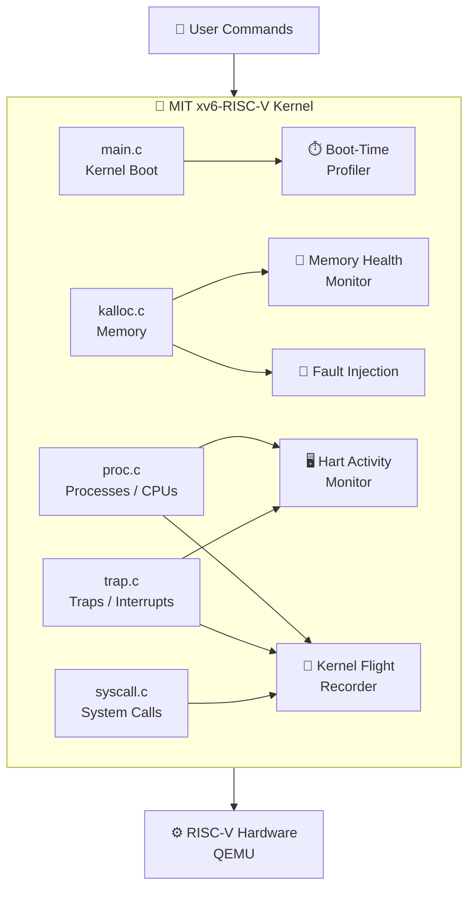
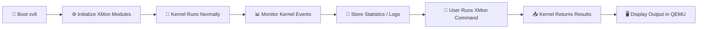
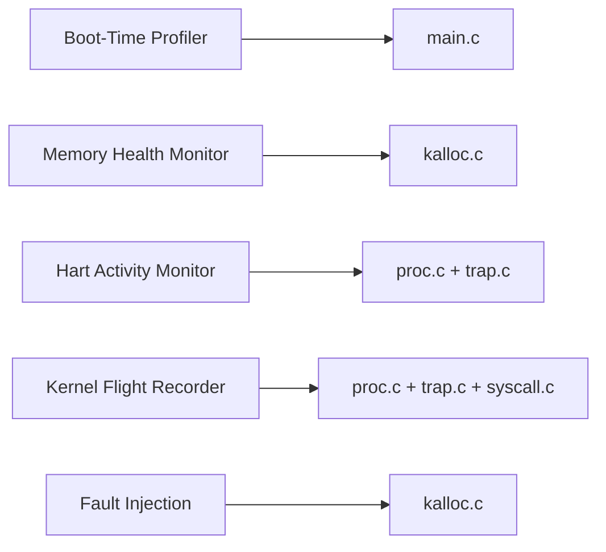

# 🧠 XMon — Kernel Monitoring & Reliability Extensions for xv6-RISC-V

> **Operating Systems Project Proposal**  
> Base Kernel: **MIT xv6-RISC-V**

---

## 📌 Project Overview

**XMon** is a university Operating Systems project based on the official **MIT xv6-RISC-V kernel**.  
The project will extend xv6 by adding **5 unique kernel modules** focused on monitoring, diagnostics, multicore activity, event tracing, and controlled reliability testing.

The main goal is to keep the original xv6 design simple while adding useful features that are easy to understand, implement, test, and demonstrate.

---

## 🧩 Proposed 5 Modules

### 1. ⏱️ Boot-Time Profiler
Measures the time or CPU cycles used by important xv6 kernel initialization stages during boot.

### 2. 🧠 Kernel Memory Health Monitor
Tracks physical memory usage such as free pages, used pages, allocation calls, free calls, peak usage, and failed allocations.

### 3. 🖥️ Per-CPU / RISC-V Hart Activity Monitor
Tracks basic activity of each RISC-V CPU/hart, including timer events, kernel entries, and selected trap activity.

### 4. 📜 Kernel Flight Recorder
Stores recent important kernel events in a circular buffer so they can later be viewed like a small kernel “black box”.

### 5. 🧪 Controlled Kernel Fault Injection
Allows selected failures, such as controlled memory-allocation failures, to be generated for testing kernel reliability.

---

## 🏗️ System Architecture



---

## 🔄 Working Flow



---

## 🔗 Module-to-Kernel Mapping



---

## 🛠️ Main Technologies

- **C** — kernel and user-space code
- **RISC-V** — target architecture
- **MIT xv6-RISC-V** — base operating system
- **QEMU** — RISC-V emulation
- **GNU Make** — build system
- **Git & GitHub** — version control and documentation
- **WSL / Ubuntu** — recommended development environment

---

## 🎯 Final Goal

The final project will demonstrate:

```text
MIT xv6-RISC-V
      +
5 Custom Kernel Modules
      =
XMon Enhanced xv6 Kernel
```

The project will remain small enough to understand and explain, while still looking professional and unique for a university Operating Systems project.

---

## 📊 Current Status

**Status:** Project Selected / Planning Stage  
**Implementation:** Not started yet  
**Next Step:** Run original xv6 successfully and then implement each module one by one.

---

## 📚 Base Project

Official MIT xv6-RISC-V Repository:  
https://github.com/mit-pdos/xv6-riscv
